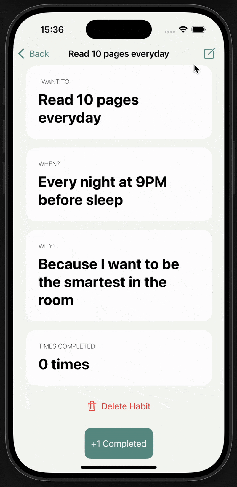
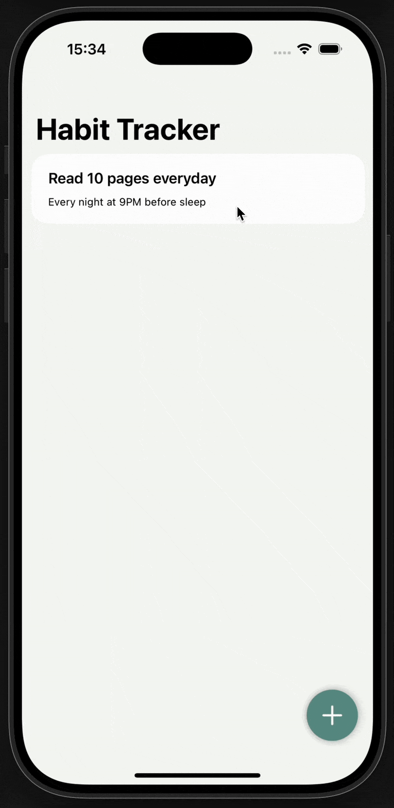
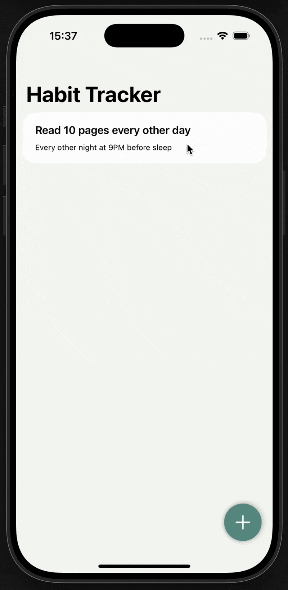

# Habit Tracker App

A simple habit tracking app designed to help users build good routines. This project was a a way for me to consolidate on the following topics that I've been learning:
- Navigation using SwiftUI's built in `NavigationStack` and `NavigationLink` views
- `UserDefaults` for data persistance
- Dynamic lists using `ForEach` and `List`
- SwiftUI's built in alert dialogs
-  `Codable`, `JSONEncoder`, `JSONDecoder` to encode/decode custom habit objects
-  `sheet()` and `dismiss()` modal views for adding habits

## Demo

| Add Habit | Edit Habit |
|-----------|------------|
|  |  |

| Delete Habit | Log Completion |
|--------------|----------------|
|  |  |

## Features

- Create, edit, and delete habits
- Log completion everytime users complete a habit
- Light and clean interface
